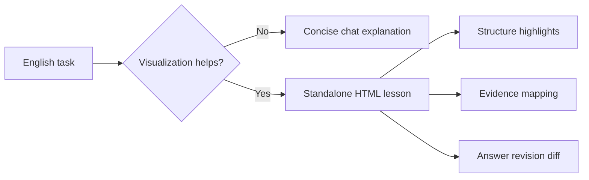

<div align="center">

# Juken English Visual Explainer

### 受験英語を、構造・根拠・答案差分で見える化する。

大学受験英語の問題を、内容に合わせてチャット解説または単一HTML教材に変換するCodexスキルです。

[Skill File](./juken-english-visual-explainer/SKILL.md) · [System Prompt](./juken-english-visual-explainer/references/system-prompt-full.md) · [Examples](./juken-english-visual-explainer/examples/prompts.md)

</div>

<div align="center">


</div>

---

## Overview

Juken English Visual Explainerは、大学受験英語の問題を「最も理解しやすい形」で解説するためのスキルです。

短い語法・文法問題はチャットで簡潔に説明し、英文構造、長文の根拠対応、英作文の添削差分など、視覚化した方が理解しやすい場合は、外部ライブラリなしの単一HTML教材を生成します。

単なる答え合わせではなく、なぜその答えになるのか、どこを根拠に判断するのか、答案をどう改善すればよいのかまで扱います。

## What Makes It Useful

| よくある英語解説 | このスキル |
| --- | --- |
| 正解と日本語訳だけを示す | 構文・根拠・誤答理由まで分解する |
| 英作文をざっくり直す | 修正前後、理由、再利用表現を整理する |
| 長文の根拠が見つけにくい | 段落・設問・選択肢を対応させる |
| どの形式でも同じ説明 | 問題タイプごとに出力形式を選ぶ |

## Supported Tasks

- 英作文
- 和文英訳
- 自由英作文
- 要約英作文
- 英文解釈
- 長文読解
- 文法・語法
- リスニング関連問題
- 選択肢比較
- 誤答分析

## Output Strategy



## Key Features

- 問題タイプに応じてチャット解説とHTML教材を切り替える
- 構文ハイライト、根拠マッピング、答案差分UIを生成
- 英作文では改善答案、修正理由、採点目安、再利用表現を提示
- 長文読解では段落役割、論理接続、選択肢比較を整理
- 大学公式採点基準がある場合は優先し、ない場合は推定評価として扱う
- 外部ライブラリ、CDN、リモート画像に依存しない単一HTMLを前提にする
- 他のLLMプロジェクトでも使える汎用システムプロンプトを同梱

## Repository Structure

```txt
juken-english-visual-explainer/
├─ README.md
└─ juken-english-visual-explainer/
   ├─ SKILL.md
   ├─ agents/openai.yaml
   ├─ assets/single-html-template.html
   ├─ references/system-prompt-full.md
   ├─ references/composition.md
   ├─ references/scoring-rubric.md
   ├─ references/reading.md
   ├─ references/grammar.md
   ├─ references/listening.md
   ├─ references/common-ui-patterns.md
   └─ examples/prompts.md
```

## How To Use

Codexのskillsフォルダに `juken-english-visual-explainer` フォルダを入れて、次のように依頼します。

```txt
Use $juken-english-visual-explainer to fully explain this entrance-exam English task in the clearest format.
```

他のLLMで使う場合は、次のプロンプトをシステムプロンプトとして設定します。

[`references/system-prompt-full.md`](./juken-english-visual-explainer/references/system-prompt-full.md)

## Notes

- 実在する入試長文や問題本文は含めていません。
- 公開例には自作・架空プロンプトを使う想定です。
- 採点は学習用の目安であり、公式基準がない場合は推定評価として扱います。

## License

MIT License. See [LICENSE](./juken-english-visual-explainer/LICENSE).
